# 🚀 CodeAlpha Python Internship Projects


Welcome to my **CodeAlpha Python Internship** repository.

This repository contains all the tasks completed during my **CodeAlpha Python Programming Internship**. These projects demonstrate Python programming, GUI development using Tkinter, automation techniques, and problem-solving skills.

---

# 👨‍💻 Intern Details

- **Name:** Vikrant Hanumant Kharke
- **Internship:** CodeAlpha Python Programming Internship
- **Domain:** Python Development
- **GitHub:** https://github.com/Vikrant0405

---

# 📂 Repository Structure

```text
CodeAlpha
│
├── Codealpha_Stock_portfolio_tracker
│   ├── Screenshot
│   ├── README.md
│   └── codealpha_Stock_portfolio_Tracker.py
│
├── Codealpha_Chatbot
│   ├── Screenshot
│   ├── README.md
│   └── codealpha_chatbot.py
│
├── Codealpha_Automation_with_Python_Scripts
│   ├── Screenshot
│   ├── README.md
│   └── codealpha_email_extract.py
│
└── README.md
```

---

# 📌 Projects

---

# 📈 Task 1 – Stock Portfolio Tracker

A Python GUI application that helps users manage stock investments and calculate portfolio values.

## Features

- ➕ Add Stocks
- ❌ Remove Stocks
- 📊 Portfolio Summary
- 💰 Portfolio Value Calculation
- 👤 User Profile
- 📁 CSV Export
- 🖥️ Tkinter GUI

## Technologies Used

- Python
- Tkinter

## Screenshots

### Main Dashboard

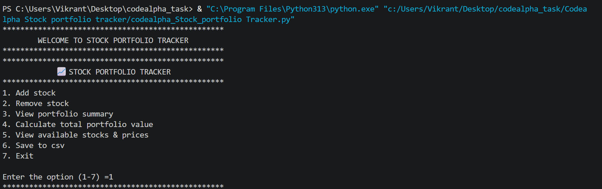

### Add Stock

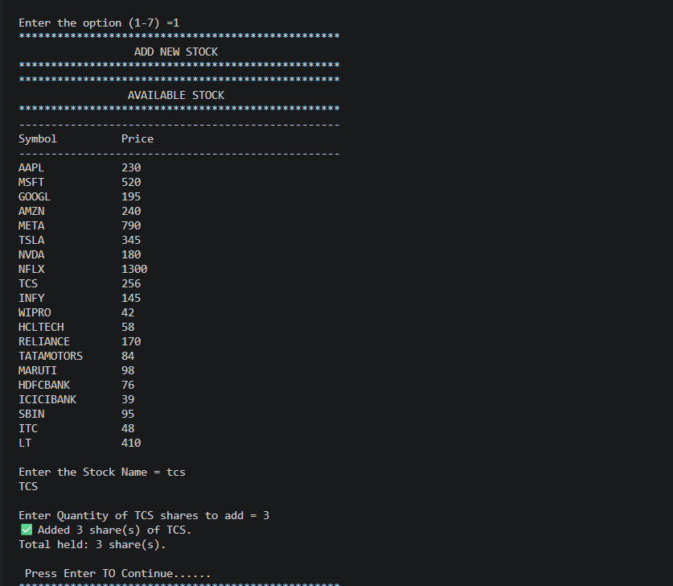

### Remove Stock

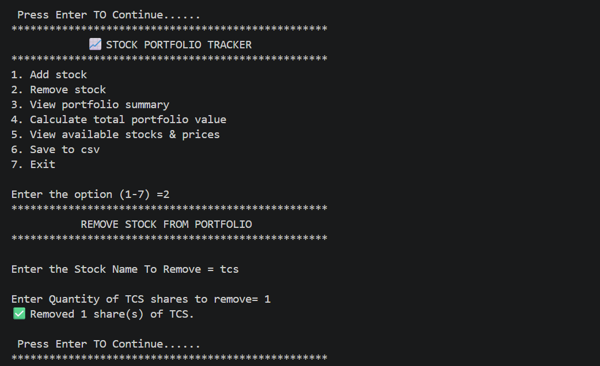

### Profile

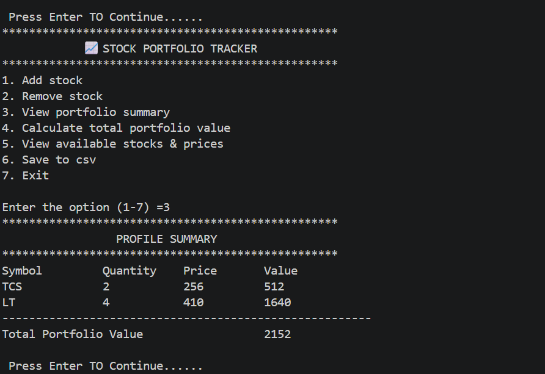

### Portfolio Value

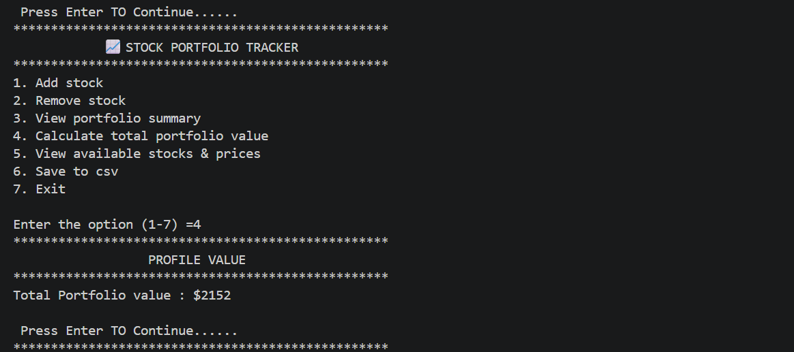

### CSV Export

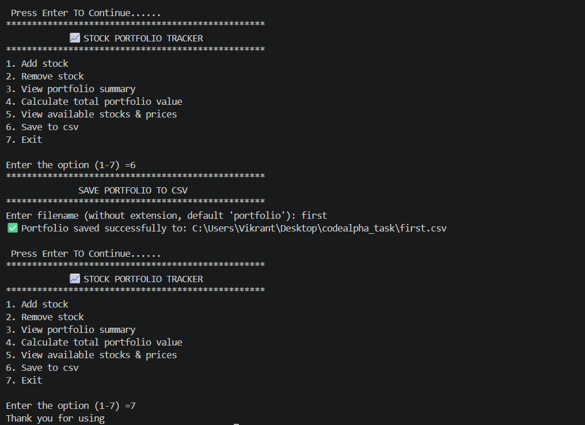

---

# 🤖 Task 2 – AI Chatbot

A rule-based chatbot developed using Python and Tkinter that interacts with users and includes mini games.

## Features

- 💬 Interactive Conversation
- 👋 Greeting Responses
- ❓ Quiz Game
- 🎯 Number Guessing Game
- ✊ Rock Paper Scissors
- 🚪 Exit Menu

## Technologies Used

- Python
- Tkinter

## Screenshots

### Home

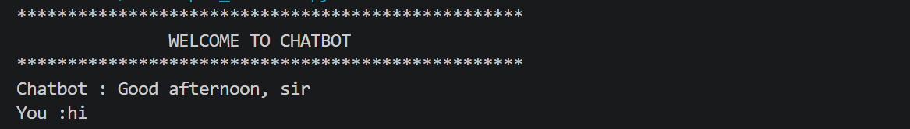

### Conversation

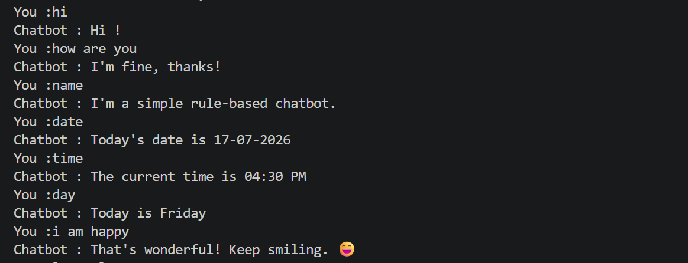

### Quiz Game

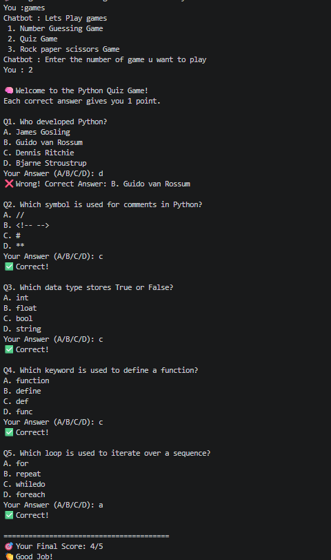

### Number Guessing Game

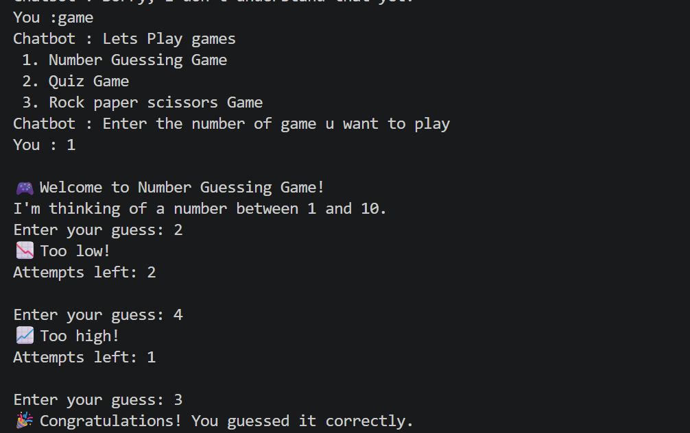

### Rock Paper Scissors

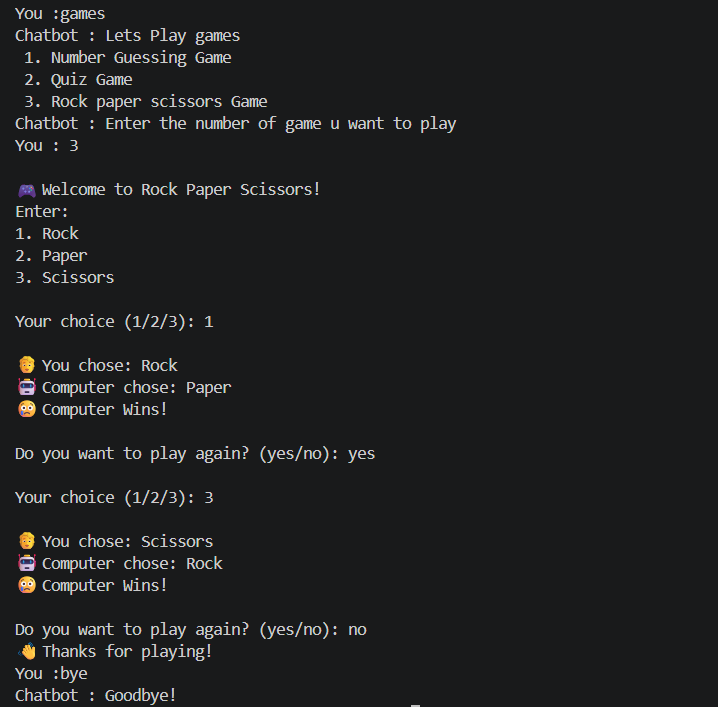

---

# ⚙️ Task 3 – Automation with Python Scripts

A Python automation tool that extracts email addresses using Regular Expressions (Regex).

## Features

- 📧 Email Extraction
- ⚡ Fast Processing
- 🖥️ Simple GUI
- 🔍 Regex Based

## Technologies Used

- Python
- Tkinter
- Regular Expressions (Regex)

## Screenshots

### Output Window

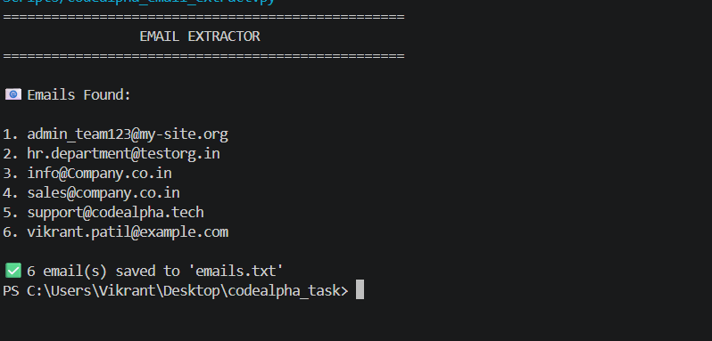

### Dialog Box

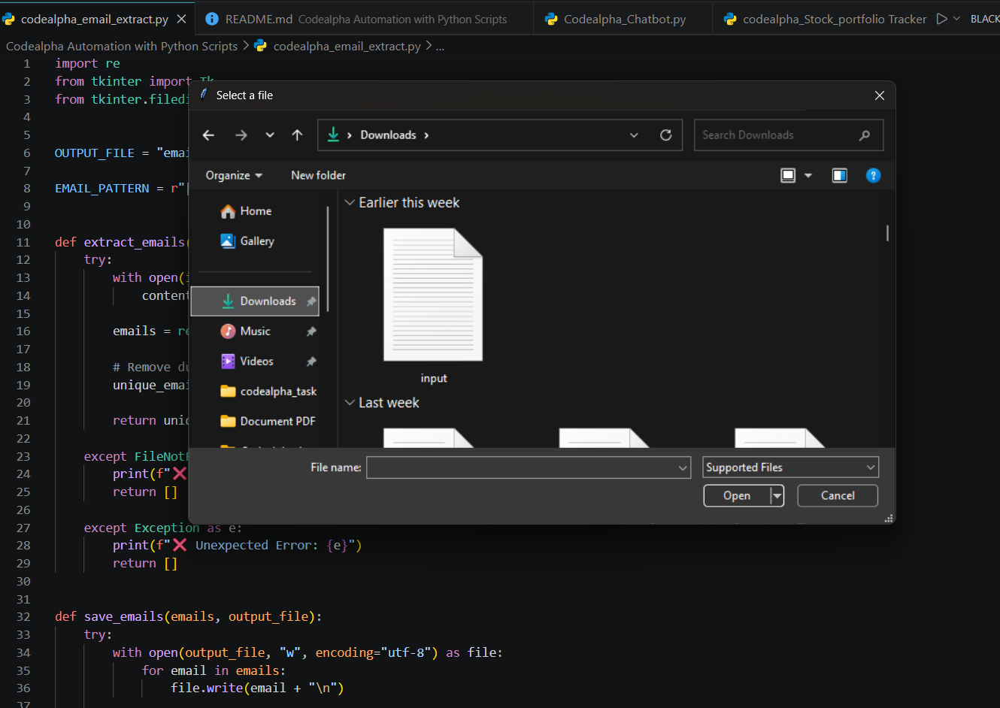

---

# 🛠 Technologies Used

- Python 3
- Tkinter
- Regular Expressions (Regex)
- Object-Oriented Programming
- File Handling
- Git
- GitHub

---

# 💻 Installation

Clone the repository:

```bash
git clone https://github.com/Vikrant0405/CodeAlpha.git
```

Go to the repository:

```bash
cd CodeAlpha
```

---

# ▶️ Run the Projects

## Stock Portfolio Tracker

```bash
cd Codealpha_Stock_portfolio_tracker
python codealpha_Stock_portfolio_Tracker.py
```

## AI Chatbot

```bash
cd Codealpha_Chatbot
python codealpha_chatbot.py
```

## Automation with Python Scripts

```bash
cd Codealpha_Automation_with_Python_Scripts
python codealpha_email_extract.py
```

---

# 🎯 Learning Outcomes

During this internship, I strengthened my skills in:

- Python Programming
- GUI Development with Tkinter
- Automation using Python
- Regular Expressions (Regex)
- Object-Oriented Programming
- File Handling
- Git & GitHub
- Problem Solving
- Project Development

---

# 📚 Internship Tasks

| Task | Project | Status |
|------|---------|:------:|
| Task 1 | Stock Portfolio Tracker | ✅ |
| Task 2 | AI Chatbot | ✅ |
| Task 3 | Automation with Python Scripts | ✅ |

---

# 🤝 Connect With Me

**GitHub:**  
https://github.com/Vikrant0405

If you found these projects helpful, don't forget to ⭐ **Star** this repository.

Thank you for visiting my repository! 🚀
